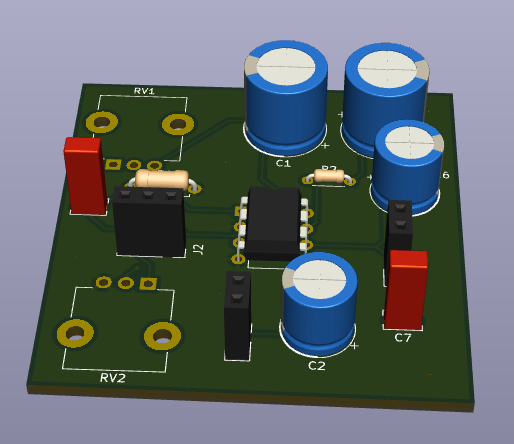

# Audio Amplifier

A compact low voltage audio power amplifier PCB based on the **LM386** integrated circuit.

## Overview

This board provides simple audio amplification suitable for driving small speakers from line-level audio sources. The LM386 is a popular choice for battery-powered audio applications due to its low power consumption and minimal external component requirements.

## Key Features

- **LM386 Audio Power Amplifier IC**
  - Wide operating voltage range: 4V to 12V
  - Built-in gain control (20-200)
  - Low quiescent current for battery operation
  
- **Connectors for:**
  - Audio input
  - Speaker output
  - Power supply

## Specifications

| Parameter | Value |
|-----------|-------|
| Main IC | LM386 |
| Operating Voltage | 4V - 12V |
| Power Output | ~1W (into 8Ω @ 12V) |
| Package | DIP-8 |

## Applications

- Portable audio devices
- DIY speaker projects
- Guitar practice amplifiers
- Intercom systems
- Audio signal boosters

## Files

- `audio amplifier.kicad_sch` - Schematic
- `audio amplifier.kicad_pcb` - PCB layout
- `audio amplifier.kicad_pro` - KiCad project file
- `gerber_gen/` - Manufacturing files

## References

- [LM386 Datasheet (TI)](http://www.ti.com/lit/ds/symlink/lm386.pdf)
