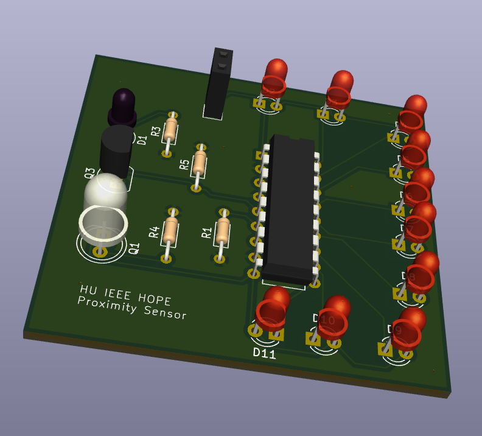

# Proximity Sensor Display

An LED bar graph display PCB using the **LM3914** dot/bar display driver IC.

## Overview

This board provides a visual 10-LED bar graph display to represent an analog signal level. The LM3914 scales the input voltage linearly across its outputs, illuminating LEDs progressively as the signal increases. This is commonly used with proximity/distance sensors to provide a visual indication of signal strength or distance.

## Key Features

- **LM3914 Dot/Bar Display Driver IC**
  - 10 individually controlled LED outputs
  - Linear scale display
  - Selectable dot or bar display mode
  - Internal voltage reference
  
- **10 LEDs** for visual signal representation

- **Connectors for:**
  - Analog signal input
  - Power supply

## Specifications

| Parameter | Value |
|-----------|-------|
| Main IC | LM3914 |
| Display Mode | Dot or Bar (configurable) |
| LED Outputs | 10 |
| Package | DIP-18 |
| Operating Voltage | 3V - 25V |

## Applications

- Proximity/distance sensor displays
- Audio level meters (VU meters)
- Battery level indicators
- Signal strength meters
- Temperature displays

## How It Works

The LM3914 contains a precision 10-step voltage divider that compares the input signal against internal reference points. As the input voltage rises, more LEDs illuminate to provide a visual representation of the signal magnitude.

## Files

- `recyclobot.kicad_sch` - Schematic
- `recyclobot.kicad_pcb` - PCB layout
- `gerbers/` - Manufacturing files

## References

- [LM3914 Datasheet (TI)](https://www.ti.com/lit/ds/symlink/lm3914.pdf)
