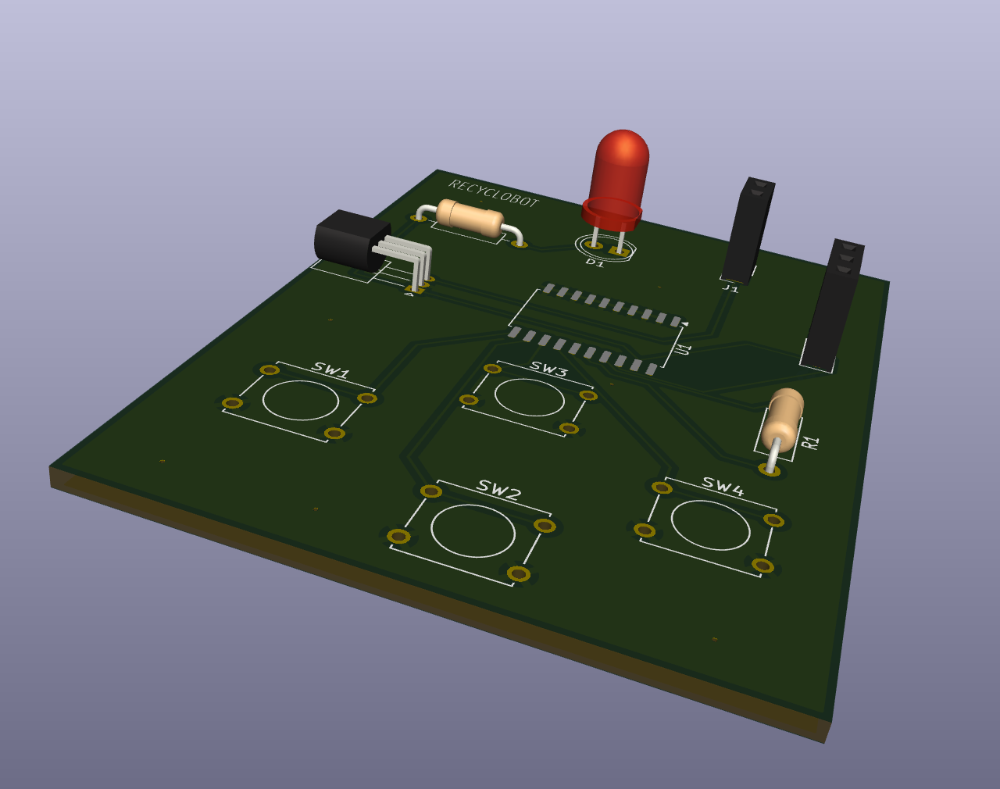

# Recyclobot Controller

An RF remote control encoder PCB using the **HT12E** serial encoder IC.



## Overview

This board serves as the wireless remote control transmitter for the Recyclobot project. It uses the HT12E encoder IC to convert button presses into a serial data stream that can be transmitted wirelessly to the Recyclobot motherboard.

## Key Features

- **HT12E Serial Encoder IC**
  - 2^12 (4096) address combinations for security
  - 4 data bits for control signals
  - Low power consumption for battery operation
  - Simple oscillator circuit using external resistor
  
- **LED indicators** for status/feedback

- **Connectors for:**
  - Control buttons/inputs
  - RF transmitter module
  - Power supply

## Specifications

| Parameter | Value |
|-----------|-------|
| Main IC | HT12E |
| Address Bits | 8 (A0-A7) |
| Data Bits | 4 (D0-D3) |
| Package | SOP-20 / DIP-18 |
| Operating Voltage | 2.4V - 12V |

## System Integration

This controller pairs with the **Recyclobot Motherboard** which uses an HT12D decoder to receive and interpret the transmitted commands.

```
┌─────────────────┐     RF Signal     ┌─────────────────┐
│   Controller    │ ─────────────────▶│   Motherboard   │
│     (HT12E)     │                   │     (HT12D)     │
│                 │                   │     (L293D)     │
└─────────────────┘                   └─────────────────┘
     Remote                                Robot
```

## Files

- `recyclobot.kicad_sch` - Schematic
- `recyclobot.kicad_pcb` - PCB layout
- `gerbers/` - Manufacturing files

## References

- [HT12E Datasheet (Holtek)](https://www.holtek.com/documents/10179/116711/2_12ev120.pdf)
