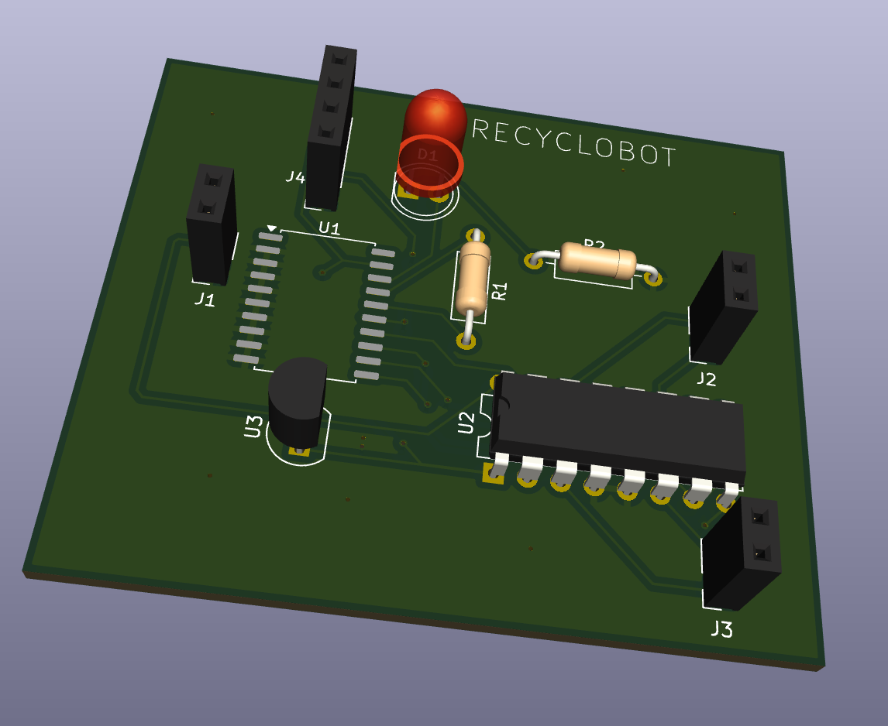

# Recyclobot Motherboard

The main motor driver PCB for the Recyclobot, featuring the **L293D** quadruple half-H motor driver IC.



## Overview

This board is the central control unit for the Recyclobot project. It receives wireless commands from the remote controller and drives DC motors to move the robot. The L293D provides bidirectional control for two DC motors with built-in protection diodes.

## Key Features

- **L293D Quadruple Half-H Motor Driver IC**
  - Dual full-bridge configuration for 2 motors
  - Bidirectional motor control (forward/reverse)
  - Built-in flyback diodes
  - Separate logic and motor supply voltages
  
- **LED indicators** for power and status

- **Connectors for:**
  - DC motor outputs (2 motors)
  - RF receiver module
  - Power supply
  - Sensor inputs

## Specifications

| Parameter | Value |
|-----------|-------|
| Main IC | L293D |
| Motor Channels | 2 (bi-directional) |
| Logic Voltage | 5V |
| Motor Voltage | 4.5V - 36V |
| Output Current | 600mA per channel (1.2A peak) |
| Package | DIP-16 |

## System Integration

This motherboard receives commands from the **Recyclobot Controller** via wireless RF link.

```
┌─────────────────┐                   ┌─────────────────┐
│   Controller    │     RF Signal     │   Motherboard   │
│     (HT12E)     │ ─────────────────▶│     (L293D)     │
└─────────────────┘                   └────────┬────────┘
                                               │
                                    ┌──────────┴──────────┐
                                    │                     │
                              ┌─────▼─────┐         ┌─────▼─────┐
                              │  Motor 1  │         │  Motor 2  │
                              │  (Left)   │         │  (Right)  │
                              └───────────┘         └───────────┘
```

## Motor Control Truth Table

| EN | IN1 | IN2 | Motor Action |
|----|-----|-----|--------------|
| H  | L   | H   | Forward      |
| H  | H   | L   | Reverse      |
| H  | L   | L   | Coast/Stop   |
| H  | H   | H   | Brake        |
| L  | X   | X   | Disabled     |

## Files

- `recyclobot_main.kicad_sch` - Schematic
- `recyclobot_main.kicad_pcb` - PCB layout
- `gerbers/` - Manufacturing files

## References

- [L293D Datasheet (TI)](http://www.ti.com/lit/ds/symlink/l293.pdf)
